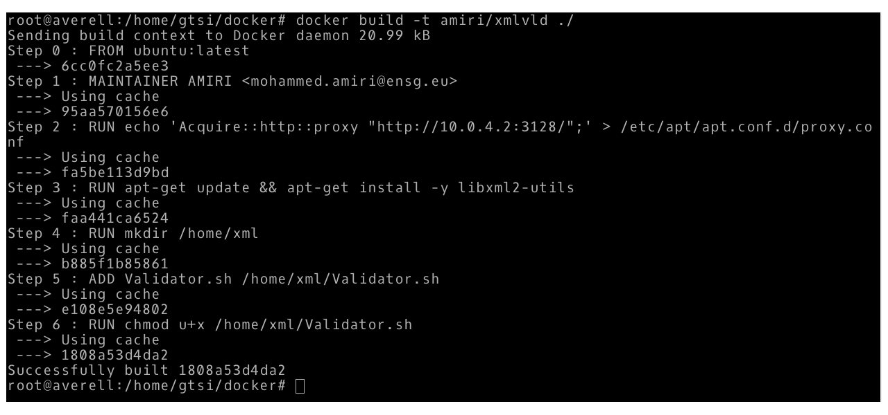
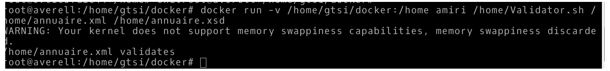

# TRAVAIL : Conteneur de validation XML
------------
## Objectif
------------
le but de ce mini projet est de fabriquer un conteneur docker qui permet de valider des fichier XML en ligne de commande.

-----------------
## le Dockerfile 
-----------------

1- téléchargement d'une image ubuntu d'un conteneur docker à partir des dépôts de docker.
FROM ubuntu:latest

2- l'auteur de dockerfile.
MAINTAINER  AMIRI <mohammed.amiri@ensg.eu>

optionel: configuration du proxy pour éxecuter le script sur un pc de l'école.
RUN echo 'Acquire::http::proxy "http://10.0.4.2:3128/";' > /etc/apt/apt.conf.d/proxy.conf

3- la mise à jour des dépots de l'image ubuntu télécharger et installation de la librairie qui permet de valider des fichier xml.
RUN apt-get update && apt-get install -y libxml2-utils

4- création d'un dossier où on ajoute le script qui exécute les lignes de commandes qui valident notre XML.
ADD Validator.sh /home/Validator.sh

5- cette ligne rend le script shell exécutable à l'intérieur de notre conteneur.
RUN chmod +x /home/Validator.sh

après l'exécution de notre dockerfile, on vérifie la création de notre image, et on push l'image dans les dépots de docker
- docker login 
- docker push medamiri/xmlvalidator

------------------------------------------
## le teste de validation d'un ficher XML
------------------------------------------
 1- la fabrication de l'image à partir de notre dockerfile.
 

 2- l'exécution de la ligne de commande qui permet de valider le fichier xml.
docker run -v /home/gtsi/docker:/home medamiri/xmlvalidator /home/Validator.sh /home/annuaire.xml /home/annuaire.xsd
 

